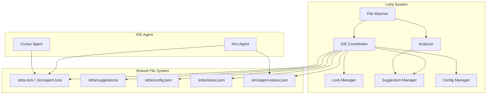

# Design Document: IDE Collaboration

## Overview

This design enables Letta Coding Assistant to detect and collaborate with agentic IDEs (Kiro, Cursor, Windsurf, Antigravity) instead of conflicting with them. The system uses file-based coordination, lock files, and a suggestion queue to ensure both systems work together effectively.

## Architecture



## Components and Interfaces

### 1. IDE Coordinator (`src/core/ideCoordinator.js`)

Central component that manages IDE detection and collaboration mode.

```javascript
// Interface
class IDECoordinator {
  constructor(projectPath) {}
  
  // Detection
  detectIDE(): IDEInfo | null
  isIDEActive(): boolean
  
  // Mode management
  getCollaborationMode(): 'passive' | 'active' | 'independent'
  setCollaborationMode(mode: string): void
  
  // Status
  getStatus(): CollaborationStatus
  broadcastStatus(status: string): void
  
  // Events
  onIDEActivity(callback: (activity: IDEActivity) => void): void
}

// Types
interface IDEInfo {
  type: 'kiro' | 'cursor' | 'windsurf' | 'antigravity' | 'unknown'
  version?: string
  configPath: string
  features: string[]
}

interface CollaborationStatus {
  mode: string
  ideDetected: IDEInfo | null
  isIDEEditing: boolean
  queuedAnalyses: number
  lastSync: Date
}
```

### 2. Lock Manager (`src/core/lockManager.js`)

Handles file locking coordination between Letta and IDE agents.

```javascript
// Interface
class LockManager {
  constructor(projectPath) {}
  
  // Lock operations
  acquireLock(filePath: string): boolean
  releaseLock(filePath: string): void
  isLocked(filePath: string): LockInfo | null
  
  // IDE lock watching
  watchIDELocks(): void
  onIDELockChange(callback: (event: LockEvent) => void): void
  
  // Conflict handling
  yieldToIDE(filePath: string): void
}

// Types
interface LockInfo {
  owner: 'letta' | 'ide'
  filePath: string
  timestamp: Date
  operation: string
}

interface LockEvent {
  type: 'acquired' | 'released'
  owner: string
  filePath: string
}
```

### 3. Suggestion Manager (`src/core/suggestionManager.js`)

Manages the suggestion queue for IDE agents to consume.

```javascript
// Interface
class SuggestionManager {
  constructor(projectPath) {}
  
  // Suggestion operations
  createSuggestion(suggestion: Suggestion): string
  markConsumed(suggestionId: string): void
  getPendingSuggestions(): Suggestion[]
  
  // Cleanup
  cleanupOldSuggestions(maxAge: number): void
}

// Types
interface Suggestion {
  id: string
  timestamp: Date
  file: string
  type: 'fix' | 'improvement' | 'warning'
  confidence: number
  description: string
  context: AnalysisContext
  fix?: FixAction
  consumed: boolean
  consumedBy?: string
}

interface FixAction {
  action: 'replace' | 'insert' | 'delete'
  search?: string
  replace?: string
  line?: number
}
```

### 4. Config Manager (`src/core/configManager.js`)

Handles collaboration configuration.

```javascript
// Interface
class ConfigManager {
  constructor(projectPath) {}
  
  // Config operations
  loadConfig(): CollaborationConfig
  saveConfig(config: CollaborationConfig): void
  getEffectiveConfig(): CollaborationConfig  // Merges global + project
  
  // Validation
  validateConfig(config: object): ValidationResult
}

// Types
interface CollaborationConfig {
  collaboration: {
    mode: 'passive' | 'active' | 'independent'
    autoDetect: boolean
    preferIDE: boolean
    suggestionFormat: 'json' | 'markdown'
  }
  lockTimeout: number
  suggestionRetention: number
  ideSpecific: {
    kiro?: KiroConfig
    cursor?: CursorConfig
  }
}

interface KiroConfig {
  readSteeringFiles: boolean
  respectSpecs: boolean
  coordinateHooks: boolean
}
```

## Data Models

### Lock File Format (`.letta.lock`)

```json
{
  "owner": "letta",
  "pid": 12345,
  "timestamp": "2025-12-27T10:30:00Z",
  "files": [
    {
      "path": "src/components/Button.tsx",
      "operation": "analyzing",
      "since": "2025-12-27T10:30:00Z"
    }
  ]
}
```

### Suggestion Format (`.letta/suggestions/{id}.json`)

```json
{
  "id": "sug_20251227_103000_abc123",
  "timestamp": "2025-12-27T10:30:00Z",
  "file": "src/components/Button.tsx",
  "type": "fix",
  "confidence": 0.85,
  "description": "Missing null check on props.onClick",
  "context": {
    "framework": "React",
    "relatedFiles": ["src/types/button.d.ts"],
    "errorType": "potential_null_reference"
  },
  "fix": {
    "action": "replace",
    "search": "onClick={props.onClick}",
    "replace": "onClick={props.onClick ?? undefined}"
  },
  "consumed": false
}
```

### Status File Format (`.letta/status.json`)

```json
{
  "status": "analyzing",
  "timestamp": "2025-12-27T10:30:00Z",
  "currentFile": "src/components/Button.tsx",
  "queueLength": 3,
  "lastAnalysis": {
    "file": "src/utils/helpers.ts",
    "result": "ok",
    "timestamp": "2025-12-27T10:29:30Z"
  },
  "sessionStats": {
    "analyzed": 15,
    "issues": 3,
    "suggestions": 2
  }
}
```

### Config File Format (`.letta/config.json`)

```json
{
  "collaboration": {
    "mode": "active",
    "autoDetect": true,
    "preferIDE": true,
    "suggestionFormat": "json"
  },
  "lockTimeout": 30000,
  "suggestionRetention": 86400000,
  "ideSpecific": {
    "kiro": {
      "readSteeringFiles": true,
      "respectSpecs": true,
      "coordinateHooks": true
    }
  }
}
```


## Correctness Properties

*A property is a characteristic or behavior that should hold true across all valid executions of a system—essentially, a formal statement about what the system should do. Properties serve as the bridge between human-readable specifications and machine-verifiable correctness guarantees.*

### Property 1: IDE Detection Enables Correct Mode

*For any* project directory with IDE indicators (`.kiro/`, `.cursor/`, `.windsurf/`, `.antigravity/`), the system SHALL detect the IDE type and enable Collaboration_Mode. *For any* project directory without IDE indicators, the system SHALL operate in standalone mode.

**Validates: Requirements 1.1, 1.2, 1.3, 1.5**

### Property 2: Lock File Coordination

*For any* file with an active IDE lock (`.kiro/agent.lock`, `.cursor/agent.lock`), the system SHALL:
- Pause auto-fix operations for that file
- Queue analysis requests instead of processing immediately
- Process queued analyses when the lock is removed
- Yield to IDE agent if both attempt to lock simultaneously

**Validates: Requirements 2.1, 2.2, 2.3, 2.4, 2.5**

### Property 3: Suggestion Format Validity

*For any* suggestion created in Collaboration_Mode, the suggestion SHALL:
- Be written to `.letta/suggestions/` directory
- Be valid JSON matching the Suggestion schema
- Include confidence score (0.0-1.0)
- Include analysis context (framework, related files, error type)

**Validates: Requirements 3.1, 3.2, 3.4**

### Property 4: Suggestion Consumption Round-Trip

*For any* suggestion that is marked as consumed, querying the suggestion SHALL return `consumed: true` with the consumer identifier.

**Validates: Requirements 3.3**

### Property 5: Force-Fix Bypass

*For any* analysis with `--force-fix` flag, the system SHALL apply fixes directly regardless of Collaboration_Mode, bypassing the suggestion queue.

**Validates: Requirements 3.5**

### Property 6: Status Broadcasting Consistency

*For any* status update written to `.letta/status.json`, the status SHALL:
- Reflect the current operation state ("idle", "analyzing", "fixing")
- Include timestamp within 1 second of actual state change
- Include current file being processed (if any)
- Include session statistics

**Validates: Requirements 5.1, 5.2, 5.3, 5.4, 5.5**

### Property 7: Config Loading and Merging

*For any* project with both global (`~/.letta/config.json`) and local (`.letta/config.json`) configs, the effective config SHALL be the merge of both with local values overriding global values.

**Validates: Requirements 6.1, 6.5**

### Property 8: Collaboration Mode Behavior

*For any* collaboration mode setting:
- "passive" → system analyzes but creates no suggestions or fixes
- "active" → system creates suggestions in `.letta/suggestions/`
- "independent" → system ignores IDE indicators and applies fixes directly

**Validates: Requirements 6.2, 6.3, 6.4**

### Property 9: Conflict Detection and Resolution

*For any* file modified by both Letta and IDE agent within the lock timeout window:
- Conflict SHALL be detected
- Both versions SHALL be preserved in `.letta-backups/`
- IDE agent's version SHALL be preferred by default
- Conflict SHALL be logged for review

**Validates: Requirements 7.1, 7.2, 7.4, 7.5**

### Property 10: Kiro Steering File Integration

*For any* Kiro workspace with steering files (`.kiro/steering/*.md`), the system SHALL read and incorporate steering content into analysis context.

**Validates: Requirements 8.1, 8.2**

## Error Handling

### IDE Detection Errors

| Error | Handling |
|-------|----------|
| Cannot read IDE config file | Log warning, continue in standalone mode |
| Malformed IDE config | Log warning, use defaults |
| IDE process detection fails | Fall back to file-based detection |

### Lock File Errors

| Error | Handling |
|-------|----------|
| Cannot create lock file | Log error, skip fix operation |
| Lock file corrupted | Delete and recreate |
| Stale lock (>30s) | Force release with warning |
| Permission denied | Log error, operate in read-only mode |

### Suggestion Errors

| Error | Handling |
|-------|----------|
| Cannot write suggestion | Log error, fall back to console output |
| Suggestion directory missing | Create directory automatically |
| Disk full | Log critical error, pause operations |

### Config Errors

| Error | Handling |
|-------|----------|
| Config file missing | Use defaults |
| Invalid JSON | Log error, use defaults |
| Unknown mode value | Log warning, use "active" |

### Conflict Errors

| Error | Handling |
|-------|----------|
| Cannot create backup | Log critical error, abort fix |
| Backup directory full | Clean old backups, retry |
| Cannot detect file changes | Use timestamp-based detection |

## Testing Strategy

### Unit Tests

Unit tests verify specific examples and edge cases:

1. **IDE Detection**
   - Test detection of each IDE type (.kiro, .cursor, .windsurf, .antigravity)
   - Test standalone mode when no IDE present
   - Test banner output includes IDE info

2. **Lock Manager**
   - Test lock acquisition and release
   - Test lock file format
   - Test stale lock cleanup

3. **Suggestion Manager**
   - Test suggestion creation with all required fields
   - Test suggestion consumption marking
   - Test cleanup of old suggestions

4. **Config Manager**
   - Test config loading from file
   - Test default values when config missing
   - Test config merging (global + local)

### Property-Based Tests

Property tests verify universal properties across all inputs using **fast-check** library.

Each property test MUST:
- Run minimum 100 iterations
- Reference the design document property
- Use tag format: **Feature: ide-collaboration, Property {number}: {property_text}**

**Test Configuration:**
```javascript
import fc from 'fast-check';

// Minimum 100 iterations per property
const testConfig = { numRuns: 100 };
```

**Property Test Examples:**

```javascript
// Property 1: IDE Detection
describe('Property 1: IDE Detection Enables Correct Mode', () => {
  it('detects IDE and enables collaboration mode', () => {
    fc.assert(
      fc.property(
        fc.constantFrom('kiro', 'cursor', 'windsurf', 'antigravity'),
        (ideType) => {
          // Setup IDE indicator
          // Verify collaboration mode enabled
        }
      ),
      testConfig
    );
  });
});

// Property 3: Suggestion Format
describe('Property 3: Suggestion Format Validity', () => {
  it('creates valid suggestions with required fields', () => {
    fc.assert(
      fc.property(
        fc.record({
          file: fc.string({ minLength: 1 }),
          type: fc.constantFrom('fix', 'improvement', 'warning'),
          confidence: fc.float({ min: 0, max: 1 }),
          description: fc.string({ minLength: 1 })
        }),
        (suggestionData) => {
          // Create suggestion
          // Verify JSON validity and required fields
        }
      ),
      testConfig
    );
  });
});

// Property 7: Config Merging
describe('Property 7: Config Loading and Merging', () => {
  it('merges global and local configs correctly', () => {
    fc.assert(
      fc.property(
        fc.record({
          globalMode: fc.constantFrom('passive', 'active', 'independent'),
          localMode: fc.option(fc.constantFrom('passive', 'active', 'independent'))
        }),
        ({ globalMode, localMode }) => {
          // Setup global and local configs
          // Verify local overrides global when present
        }
      ),
      testConfig
    );
  });
});
```

### Integration Tests

1. **End-to-End Collaboration Flow**
   - Start Letta with Kiro workspace
   - Verify collaboration mode enabled
   - Trigger file change
   - Verify suggestion created (not direct fix)
   - Simulate IDE consuming suggestion
   - Verify suggestion marked consumed

2. **Lock Coordination Flow**
   - Create IDE lock file
   - Trigger Letta analysis
   - Verify analysis queued
   - Remove IDE lock
   - Verify queued analysis processed

3. **Conflict Resolution Flow**
   - Simulate concurrent modifications
   - Verify conflict detected
   - Verify backups created
   - Verify IDE version preserved
